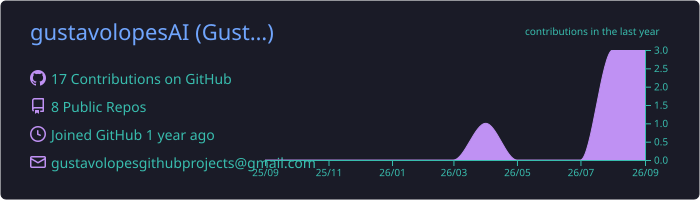
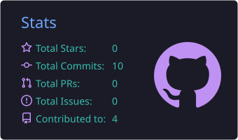
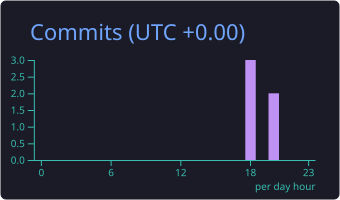
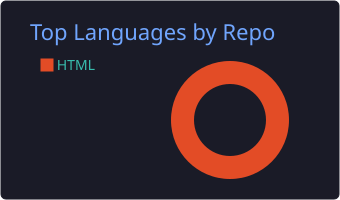
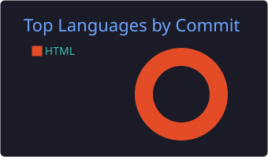

  
  
  

---

### 🧑‍💻 Sobre mim

- 🎓 Bacharelado em **Ciência de Dados e Inteligência Artificial** na **Universidade Estadual de Londrina (UEL)**, 2026–2029
- ⚙️ Curso técnico em **Eletromecânica** no **SENAI**, unindo dados e processos industriais (Indústria 4.0)
- 📊 Trabalho com limpeza de dados, análise exploratória (EDA), dashboards e machine learning
- 🔬 Atualmente: clusterização com **k-Means**, engenharia de features e visualização de dados
- 🌎 Português nativo · Inglês avançado (**C1**)
- 📍 Londrina, PR, Brasil

### 🛠️ Tecnologias

  

  
  
  
  
  
  
  

### 📈 Estatísticas

  

  
  

  
  

  

### 🐍 Contribuições

<picture>
  <source media="(prefers-color-scheme: dark)" srcset="https://raw.githubusercontent.com/gustavolopesAI/gustavolopesAI/output/github-snake-dark.svg">
  
</picture>

---

  Estatísticas atualizadas automaticamente pelo GitHub Actions.

